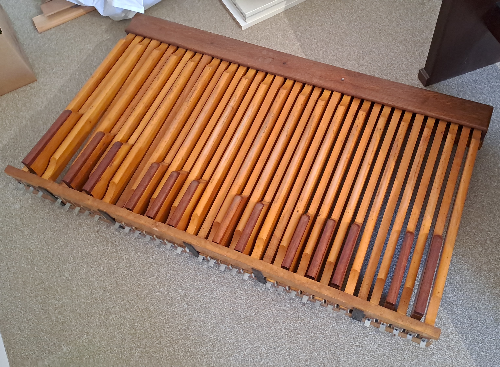
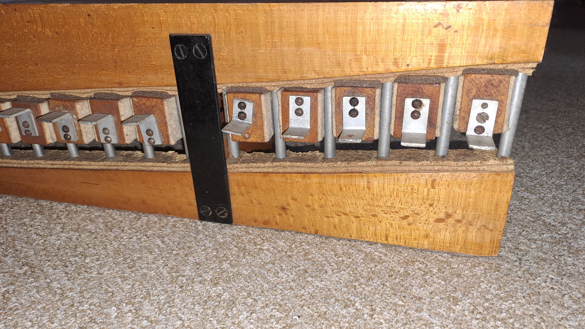
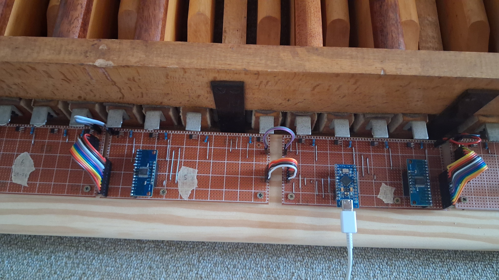
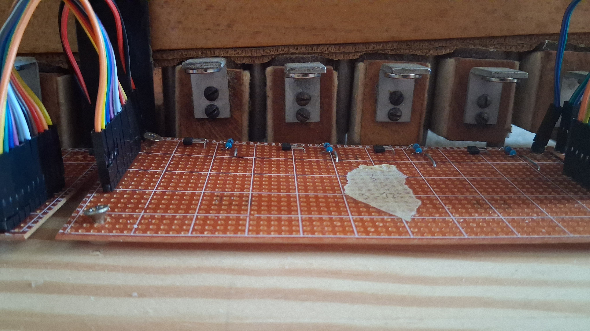
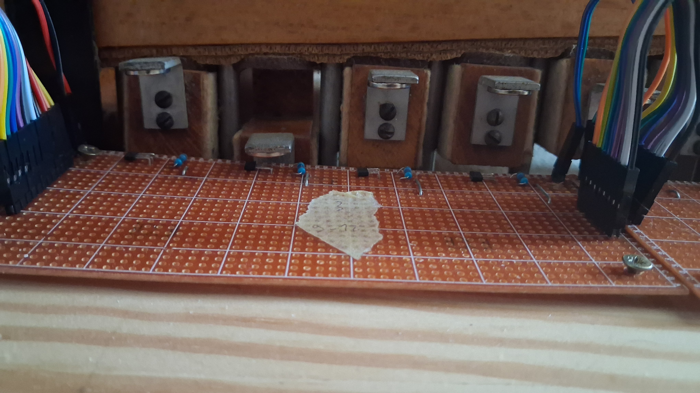

# 🎹 Arduino MIDI Pedalboard

> Convert an old 32-key pedalboard into a MIDI controller using Hall effect sensors.

Largely inspired by [Making a 25-key MIDI keyboard with an Arduino](https://medium.com/@savasolar/making-a-25-key-midi-keyboard-with-an-arduino-55f38c98fd37)

---

## ⚡ How it works

The Arduino Pro Micro is powered via USB-C from a computer. Through that same cable, it sends MIDI data directly to the computer, where [GrandOrgue](https://github.com/GrandOrgueMusic/grandorgue) interprets it as a standard pedalboard input — no additional interface or driver required.

---

## 🛠️ Electronics

| Component | Quantity |
|---|---|
| Old 32-key pedalboard | 1 |
| Arduino Pro Micro | 1 |
| Neodymium magnets (N35) | 32 |
| A3144 Hall effect sensors | 32 |
| 10 kΩ resistors | 32 |
| CD74HC4067 16-Channel Analog Multiplexer | 2 |
| Veroboards | — |

---

## 📸 Build gallery

  
   
  <em>The original 32-key pedalboard before any modification — front view</em>

  
   
  <em>Closer look at the original mechanics and key action</em>

  
   
  <em>Full electronics setup — Arduino Pro Micro, CD74HC4067 multiplexers, A3144 Hall effect sensors and 10 kΩ resistors mounted on veroboard</em>

  
   
  <em>Neodymium spherical magnets and Hall effect sensors in position — key at rest</em>

  
   
  <em>Same view with a key pressed — the magnet moves closer to the sensor, triggering the MIDI signal</em>

